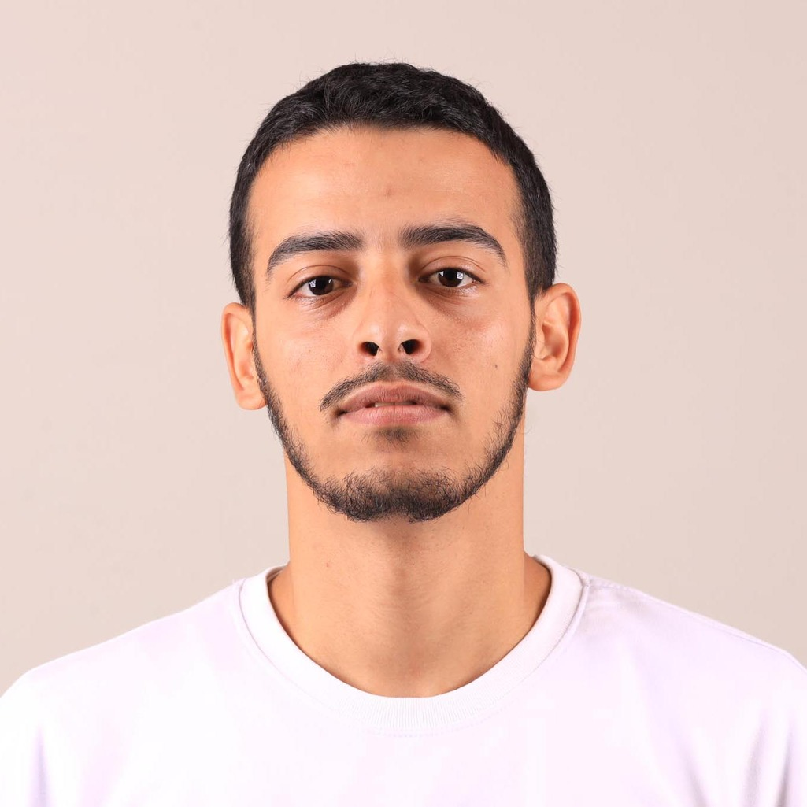

<h1 align="center">
  
</h1>

  

  Passionate Full Stack Developer from Safi, Morocco 🇲🇦 | Building robust apps with Java & Spring Boot | Currently at YouCode (UM6P) | Let's code the future! 🚀

  
  

---

### 👨‍💻 About Me
- 🌍 **Location**: Safi, Morocco
- 🎓 **Education**: 
  - Full Stack Web Development at YouCode (UM6P), 2024–2026 (Ongoing)
  - Preparation for License in SMI, Faculté Polydisciplinaire de Safi, 2023–2024
  - DEUG in Mathematics and Computer Science, Faculté Polydisciplinaire de Safi, 2020–2023
  - Bac Sciences Mathématiques B, Lycée Lalla Khadija, Dakhla, 2019–2020
- 🗣️ **Languages**: Arabic (Native), French (Intermediate), English (Intermediate)
- 💼 **Experience**: Full-Stack Web Development Intern at NeuroDental (Casablanca), Jun–Aug 2025 (2 months) – Worked on Acteo platform (legal management & CRM) using .NET, Next.js, and GraphQL.
- 🎯 **Interests**: Basketball 🏀, Swimming 🏊‍♂️, Anime 📺
- 🔧 **Over 30 Projects Completed** – From logistics systems to B2B e-commerce APIs.

---

### 🛠️ Skills
| Category | Technologies |
|----------|--------------|
| **Languages** |     |
| **Front-End** |     |
| **Back-End** |       |
| **Databases** |    |
| **Tools & Others** |        |

---

### 📊 GitHub Stats

  
  
  

---

### 📫 Get in Touch
- Email: ahmed.taoudi.28@gmail.com
- LinkedIn: [ahmed_taoudi](https://www.linkedin.com/in/ahmed-taoudi-02a57a337/)

  

Thanks for visiting! Feel free to star ⭐ or fork my repos. Let's connect! 🤝
